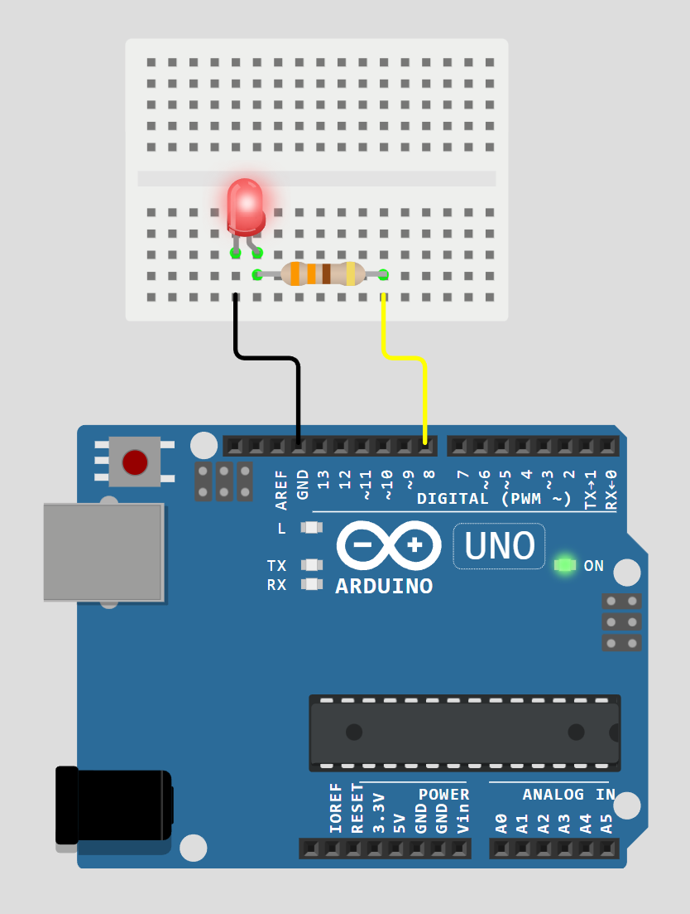

----
# Proje 02 – Harici LED + Direnç
----
## Amaç
Breadboard üzerinde **harici bir LED’i güvenli şekilde** yakıp söndürmek ve **direncin (akım sınırlama)** mantığını öğrenmek.

## Gerekli parçalar
- 1x LED
- 1x 220Ω direnç (kırmızı-kırmızı-kahverengi)
- Breadboard
- Jumper kablo
- Arduino UNO uyumlu kart

---

## Bağlantı
Bu projede bağlantı sırası **seri** olmalıdır:

**D8 → LED → 220Ω direnç → GND**

- LED’in **uzun bacağı (anot, +)**: D8 pinine giden hat
- LED’in **kısa bacağı (katot, -)**: direnç tarafı
- Direncin diğer ucu: GND

> İpucu: Breadboard’da delikler 5’li gruplar halinde bağlıdır. Direncin iki bacağı **aynı 5’li grupta** olursa direnç devreye girmez.

---

## Bağlantı Görseli


---

## Kod
Kod dosyası: **`code.ino`**

```cpp
/*
  Proje 02 – Harici LED + Direnç
  Amaç: D8 pininden harici bir LED'i yakıp söndürmek ve
  direncin LED akımını sınırlamak için neden gerekli olduğunu görmek.
*/

const int LED_PIN = 8;  // Harici LED'i bağladığımız dijital pin

void setup() {
  // setup(): Kart açıldığında 1 kez çalışır.
  // LED pinini çıkış olarak ayarlıyoruz.
  pinMode(LED_PIN, OUTPUT);
}

void loop() {
  // loop(): Sürekli tekrar eder.

  digitalWrite(LED_PIN, HIGH); // LED'i yak
  delay(500);                  // 500 ms bekle

  digitalWrite(LED_PIN, LOW);  // LED'i söndür
  delay(500);                  // 500 ms bekle
}
